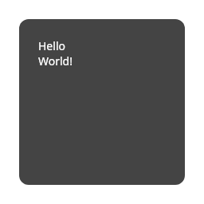

# Rumpose

Rumpose is a GUI library similar to Jetpack Compose, built on top of compose-rt.

At the moment it is in the early stages of development and many things are still missing (animations, normal subcomposition layout implementation, various modifiers, possibly macros).

## Example

```rust
use std::fs;

use rumpose::prelude::*;

fn main() {
    let mut recomposer =
        Composer::compose(|scope| app(scope.child()), RumposeContext::new(256, 256));

    for _ in 0..10 {
        recomposer.recompose();

        recomposer.with_composer_mut(|composer| {
            composer.compute_layout();
            composer.draw_all();
        })
    }

    recomposer.print_tree_with(recomposer.root_node_key(), |node| node.unwrap().to_string());

    recomposer.with_composer_mut(|composer| {
        fs::write("./image.png", composer.context.encode()).expect("failed to write");
    });
}

fn app(scope: Scope) {
    column(
        scope,
        Modifier
            .fill_max_size()
            .padding_all(24.)
            .clip(RoundedShape::new_all(12.0))
            .background(Color::DARK_GRAY)
            .padding_all(24.),
        move |scope| {
            text(scope, TextProps::new("Hello"));
            text(scope, TextProps::new("World!"));
        },
    );
}
```



## License

Rumpose is dual-licensed to be compatible with the Rust project and `compose-rt` crate.

Licensed under the [Apache License, Version 2.0](http://www.apache.org/licenses/LICENSE-2.0) or the [MIT license](http://opensource.org/licenses/MIT), at your option. This project may not be copied, modified, or distributed except according to those terms.
